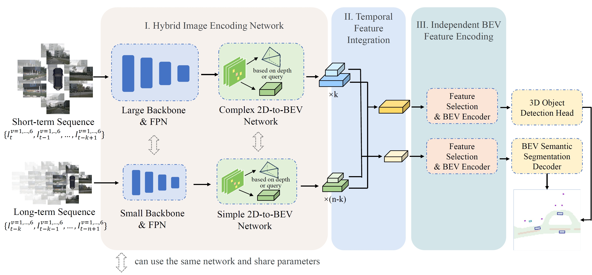
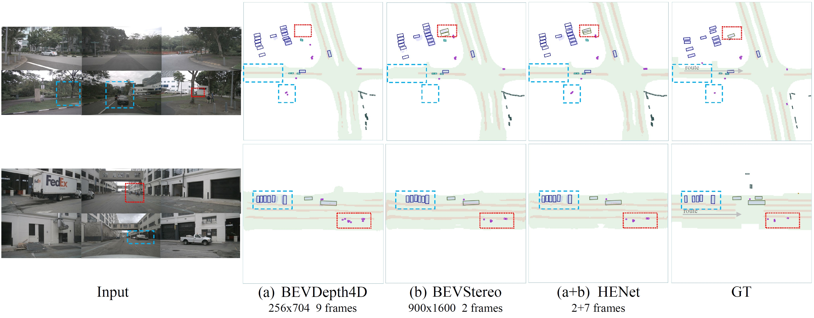
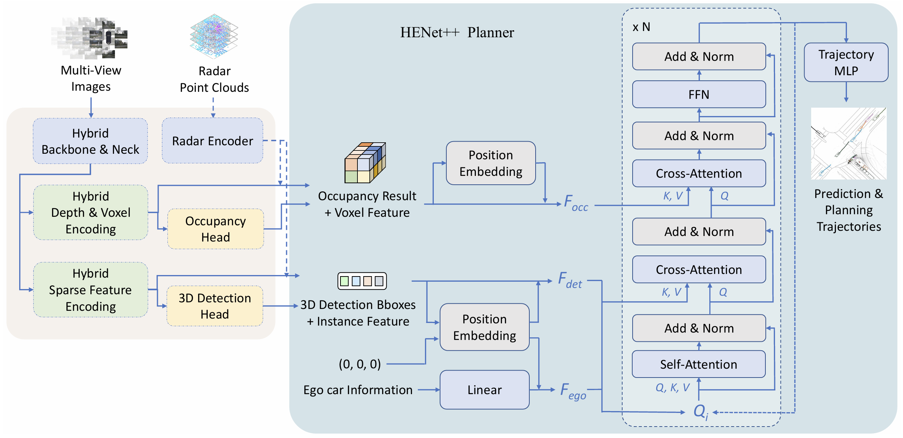

# HENet Series

This is the official implementation of **HENet: Hybrid Encoding for End-to-end Multi-task 3D Perception from Multi-view Cameras**
(ECCV 2024, [Paper](https://arxiv.org/pdf/2404.02517)) and **HENet++: Hybrid Encoding and Multi-task Learning for 3D Perception and End-to-end Autonomous Driving**
([Paper](https://arxiv.org/pdf/2511.07106)).


## HENet Introduction

HENet is an end-to-end multi-task 3D perception framework. 
It reduces training costs through hybrid image encoding and mitigates multi-task conflicts through independent BEV feature encoding.



### Demo




Visualization results of HENet and baselines on end-to-end multi-tasking. 
The proposed HENet estimates occluded objects better through long-term information and have more accurate predictions through high-resolution information.


## HENet++ Introduction

HENet++ extends HENet to end-to-end planning. 
It simultaneously extracts both dense and sparse features, 
providing more suitable representations for different tasks, reducing cumulative errors, 
and delivering more comprehensive information to the planning module.



### Demo


## Main Results

This repository provides a sample model for hybrid encoding and multi-task decoding:


|       | mAP  | NDS  |  mIoU |      config       |      model       |
| :---: |:----:|:----:| :---: |:-----------------:|:----------------:|
| HENet | 49.8 | 59.8 | 58.0 | [HENet](configs/henet/henet_det_bevseg.py) | [Google Drive](https://drive.google.com/drive/folders/1AYajSnL1JLrFOTHcpjX7WlRRLXUxQhwV?usp=sharing) |

Additionally, this repository provides a student distilled model for HENet++ end-to-end autonomous driving. 
This model was distilled using a high-precision HENet++ model as the teacher and achieves a comparable end-to-end collision rate. 
It serves as a baseline and has been applied in the [KnowVal](https://github.com/VDIGPKU/KnowVal) and DrivingAgent frameworks.


|         | UniAD L2 | UniAD Col | VAD L2 | VAD Col |                            config                             |      model       |
|:-------:|:--------:|:---------:|:------:|:-------:|:-------------------------------------------------------------:|:----------------:|
| HENet++ |   1.29   |   0.12%   |  0.55  |  0.04%  | [HENet++](configs/henetpp/henetpp_e2e_lightweight_distill.py) | [Google Drive](https://drive.google.com/drive/folders/1AYajSnL1JLrFOTHcpjX7WlRRLXUxQhwV?usp=sharing) |


## Getting Started

### Environment

The code is tested in the following two environments:

```
cuda     12.1
pytorch  2.0.1+cu118 
GPU      A800, A40
(Need to manually comment out the cuda version check of pytorch)
(For a detailed package list, please refer to envs_list_cu121.txt)

cuda     11.3
pytorch  1.12.1+cu113
GPU      RTX8000, RTX3090, V100, P40
(For a detailed package list, please refer to envs_list_cu113.txt)
```

The most recommended installation steps are:

1. Create a Python environment. Install [PyTorch](https://pytorch.org/get-started/previous-versions/)
   corresponding to your machine's CUDA version;

2. Install [mmcv](https://github.com/open-mmlab/mmcv) corresponding to your PyTorch and CUDA version;

3. Install other dependencies of mmdet and install [mmdet](https://github.com/open-mmlab/mmdetection);

4. Install other dependencies of this project (Please change the spconv version
   in the requirements.txt to the CUDA version you are using) and setup this project;

```bash
python setup.py develop
```

5. Compile some operators manually.

```bash
cd mmdet3d/ops/csrc
python setup.py build_ext --inplace
cd ../deformattn
python setup.py build install
```

6. Install other dependencies of detectron2 and install [detectron2](https://github.com/facebookresearch/detectron2);

```bash
cd detr2
python setup.py develop
```

### Data Preparation

Please download nuScenes-v1.0-trainval and nuScenes-map-expansion-v1.3
at [nuScenes.org](https://www.nuscenes.org/nuscenes) and `CVPR23-Occupancy/gts.tar.gz` at
[CVPR2023-3D-Occupancy-Prediction](https://github.com/CVPR2023-3D-Occupancy-Prediction/CVPR2023-3D-Occupancy-Prediction).

If your folder structure is different from the following, you may need to change the
corresponding paths in config files.

```
├── mmdet3d
├── tools
├── configs
├── data
│   ├── nuscenes
│   │   ├── maps
│   │   │   ├── basemap
│   │   │   ├── expansion
│   │   │   ├── prediction
│   │   │   ├── *.png
│   │   ├── samples
│   │   ├── sweeps
│   │   ├── v1.0-test
|   |   ├── v1.0-trainval
```

We recommend that you download the processed data index file directly via this [Google Drive link](https://drive.google.com/drive/folders/1AYajSnL1JLrFOTHcpjX7WlRRLXUxQhwV?usp=sharing).

Prepare nuScenes data by running:

```bash
python tools/create_data_nuscenes_C.py
```

### Training

```bash
./tools/dist_train.sh $config_path $gpus
```

### Testing

Testing on validation set:

```bash
./tools/dist_test.sh $config_path $checkpoint_path $gpus --eval bbox
```

Testing on test set:

```bash
./tools/dist_test.sh $config_path $checkpoint_path $gpus --format-only --eval-options 'jsonfile_prefix=work_dirs'
mv work_dirs/pts_bbox/results_nusc.json work_dirs/pts_bbox/{$name}.json
```

If you have any other questions, please refer to
<a href='https://mmdetection3d.readthedocs.io/en/v1.0.0rc1/'>mmdet3d docs</a>.

## Acknowledgements

We sincerely thank these excellent open-source projects:

- [BEVDet](https://github.com/HuangJunJie2017/BEVDet)
- [mmdetection3d](https://github.com/open-mmlab/mmdetection3d)
- [SparseBEV](https://github.com/MCG-NJU/SparseBEV)
- [detectron2](https://github.com/facebookresearch/detectron2)

## Citation

If this work is helpful for your research, please consider citing our paper 
[HENet++](https://arxiv.org/pdf/2511.07106) and
[HENet](https://arxiv.org/pdf/2404.02517).

```
@article{xia2025henet++,
  title={HENet++: Hybrid Encoding and Multi-task Learning for 3D Perception and End-to-end Autonomous Driving},
  author={Xia, Zhongyu and Lin, Zhiwei and Wang, Yongtao and Yang, Ming-Hsuan},
  journal={arXiv preprint arXiv:2511.07106},
  year={2025}
}

@inproceedings{xia2024henet,
  title={HENet: Hybrid Encoding for End-to-end Multi-task 3D Perception from Multi-view Cameras},
  author={Xia, Zhongyu and Lin, Zhiwei and Wang, Xinhao and Wang, Yongtao and Xing, Yun and Qi, Shengxiang and Dong, Nan and Yang, Ming-Hsuan},
  booktitle={Proceedings of the European Conference on Computer Vision},
  year={2024}
}
```

## License
The project is only free for academic research purposes but needs authorization for commerce. For commerce permission, please contact wyt@pku.edu.cn.
